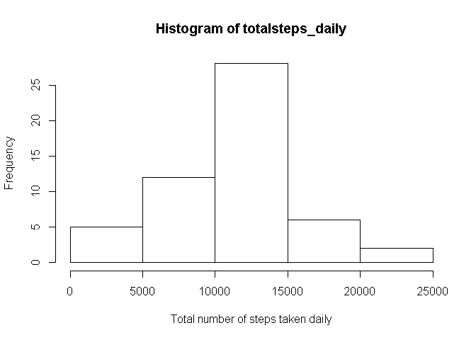
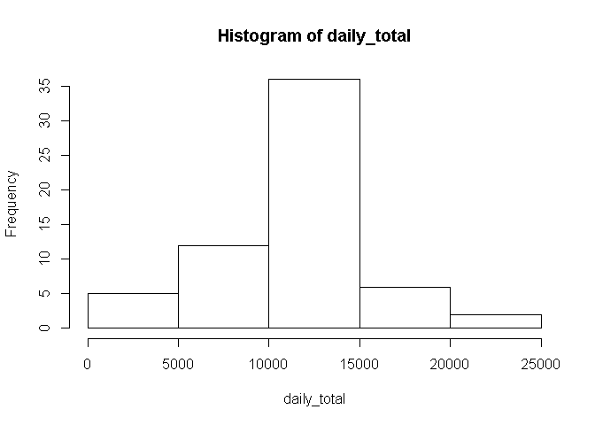

### Reoroducible Research : Peer Assessment 1

The goal of this assignment is to present the result of the Peer Assignment1 in a R Markdown file. This R markdown file is processed by knitr and transformed into a HTML file.

This assignment makes use of data from a personal activity monitoring device. This device collects data at 5 minute intervals through out the day. The data consists of two months of data from an anonymous individual collected during the months of October and November, 2012 and include the number of steps taken in 5 minute intervals each day.


The data for this assignment can be downloaded from the course web site:

.  Dataset: [Activity monitoring data](https://d396qusza40orc.cloudfront.net/repdata%2Fdata%2Factivity.zip)

The variables included in this dataset are:

.	steps: Number of steps taking in a 5-minute interval(missing values are coded as NA)

.	date: The date on which the measurement was taken in YYYY-MM-DD format

.	interval: Identifier for the 5-minute interval in which measurement was taken

####Question 1

 <b>Loading and preprocessing the data.</b>

 1. In this step we use read.csv function to read the data and store in a variable             
    called data
 
    
    ```r
    data<- read.csv("activity.csv")
    data$date <- as.Date(data$date) 
    ```

#### Question 2

<b>What is mean total number of steps taken per day? .</b>

1. In the first part, we have to make a histogram of the total number of steps taken 
   each day.

    For this, first I have  calculated the total number of steps taken daily using  
    tapply function  and store in a variable totalsteps_daily.
    
    Next I drew a histogram using hist with the variable totalsteps_daily.This graphs  
    shows the total number of steps taken daily.
    
    
  
    
    ```r
    totalsteps_daily <- tapply(data$steps, data$date, sum )
    hist(totalsteps_daily, xlab="Total number of steps taken daily")
    ```
    
     
  

2. In the second part, we have to calculate the mean and median of total number of 
   steps taken daily.

    For this, I have used mean() and median() function and set na.rm=TRUE to remove     
    all the NA values.
   
    
    ```r
    mean_per_day <- mean(totalsteps_daily, na.rm=TRUE)
    median_per_day <- median(totalsteps_daily, na.rm=TRUE)
    ```

    
    ```r
    mean_per_day
    ```
    
    [1] 10766
    
    ```r
    median_per_day
    ```
    
    [1] 10765


####Question 3

<b>What is the average daily activity pattern?</b>

1. In the first part, we have to make a time series plot.

    We have to make a plot of type "l" of the 5 minute interval on x axis and   
    the average number of steps taken which is averaged across all day on the y axis.

    So, first I calculate the average of steps for each of 5 minutes interval over  
    all day. And then Plot time series of the 5-minute interval and the average number   
    of steps taken.
    
    
    
    ```r
    steps_interval <- tapply(data$steps , data$interval, mean, na.rm=TRUE )
    intervals <- data$interval[1:288]
    
    plot(intervals, steps_interval, type="l", xlab="5 minute of Interval", ylab
         ="Average number of steps")
    ```
    
     
    
    
2. The second part is to get the 5 minute interval which contains the maximum number   
   of steps, on average across all the days in the dataset.
   
    To find the maximum, I have used the function which.max() on steps_interval.
    
    
    ```r
     maxstep<-steps_interval[which.max(steps_interval)]
    ```

    
    ```r
     maxstep
    ```
    
      835 
    206.2 

  So, based on steps taken pattern, we can draw conclusion that the daily activity  
  peaks around 8:35am.
  
#### Question 4

<b>Imputing missing values</b>

1. In the first part, we have to calculate  the total number of missing values in the  
   dataset. 
 
    So first I have to get the total number of rows with NA values.

    
    ```r
       n <- sum(is.na(data$steps))
    ```

    The total number of missing values is 2304.


2. In the second part, we have to fill all the missing values and create a new  
  dataset that is equal to the original dataset but with the missing data filled in.

    I have filled the missing values with the average number of steps in that interval.

    
    ```r
    for (i in 1:length(data$steps)) {
    if (is.na(data$steps[i])) {
        data$steps[i] <- mean(data$steps[data$interval == data$interval[i]], na.rm   
                              =TRUE)
      }
     }
    ```


3.In the next step we have to make a histogram of the total number of steps taken each   
  day and calculate and report the mean and median total number of steps taken per day
  
    Here is a histogram of the total number of steps taken each day.

    
    ```r
      daily_total <- tapply(data$steps, data$date, sum)
      hist(daily_total)
    ```
    
     

    The mean and median are calculated as follows:
  
    
    ```r
       mean_per_day <- mean(daily_total, na.rm=TRUE)
       median_per_day <- median(daily_total, na.rm=TRUE)
    ```

  <b> The mean is 1.0766 &times; 10<sup>4</sup> and the median is 1.0766 &times; 10<sup>4</sup>.</b>
   
   <b>Observation</b>
   With the values of mean and median of new dataset with all the missing data filled 
   in, I can say that there is not much difference between this value and the 
   firstpart of the assignment.
  
   The impact of imputing missing data on the estimates of the total daily number of 
   steps is that the frequency count has been increased but there is not much change 
   in the shape of the histogram.
   
   
  <b> So, the overall impact of the missing data seems rather low when estimating the 
   total number of steps per day.</b>
   
  
#### Question 5

<b>Are there differences in activity patterns between weekdays and weekends?</b>
   
 1. In the first part we have to create a new factor variable in the dataset with two  
    level-"weekday" and "weekend" indicating whether the given date is weekday or  
    weekend day.
   
    
    
    ```r
    daytype <- function(date) {
    if (weekdays(as.Date(date)) %in% c("Saturday", "Sunday")) {
        "weekend"
     } else {
        "weekday"
     }
    }
       data$daytype <- as.factor(sapply(data$date, daytype))
    ```


2.In the second part,we have to make a  plot containing a time series plot (i.e. 
  type = "l") of the 5-minute  interval (x-axis) and the average number of steps taken 
  , averaged across all weekday days or weekend days (y-axis).
  
  
  
    
    ```r
    weekend_mean <- tapply(data$steps[data$daytype=="weekend"], data$interval[data$daytype=="weekend"], mean)
    weekday_mean <- tapply(data$steps[data$daytype=="weekday"], data$interval[data$daytype=="weekday"], mean)
    
    par(mfrow=c(2,1))
    plot(intervals, weekend_mean, type="l", xlab="Interval", ylab="Number of steps", main="weekend")
    plot(intervals, weekday_mean, type="l", xlab="Interval", ylab="Number of steps", main="weekday")
    ```
    
     

  <b>Observation</b> 
  The plot shows that the person is more active on the weekdays than weekend.


 
   ==============================================================================


  
   
 
  
  
  
  
